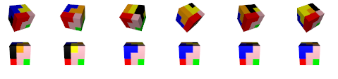

Using R to solve the Soma cube
=====================

I used R to find all the solutions to the Soma cube(https://en.wikipedia.org/wiki/Soma_cube) in R. It even outputs a 3d interactive visualization of all the solutions. Here is what a few look like, but you can run the R code to get an interactive version.

